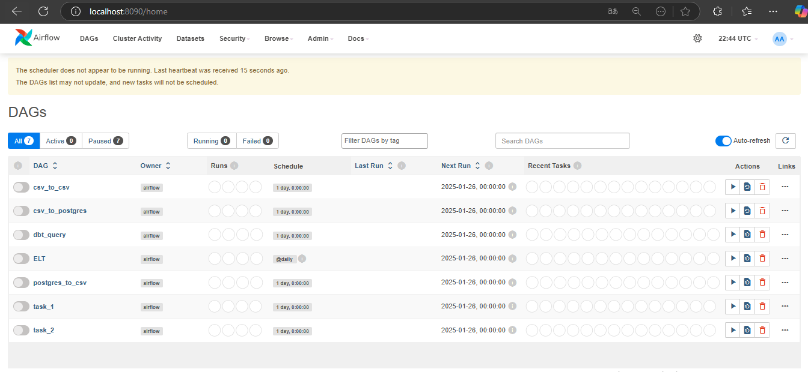
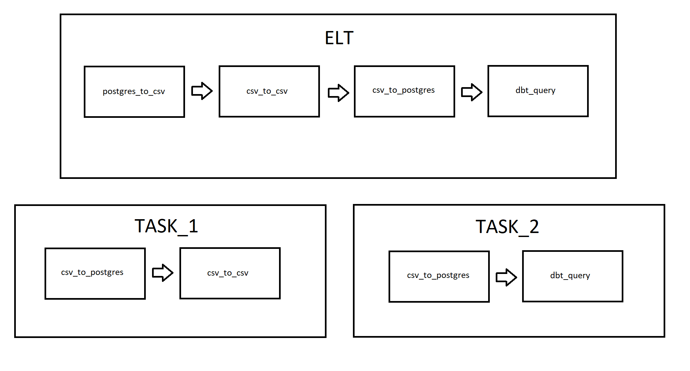

# Pré-requisitos

Antes de começar, certifique-se de que as versões a seguir do Docker e do Docker Compose estão instaladas:

- **Docker**: versão 26.1.1
- **Docker Compose**: versão v2.27.0-desktop.2

# Instalação

Este projeto é totalmente containerizado, o que significa que você precisará apenas do Docker e do Docker Compose para executá-lo.

1. Clone o repositório:
   ```bash
   git clone https://github.com/SilvaDenisVictor/code-challenge.git
2. Entre na pasta:
   ```bash
   cd projeto
3. Entre na pasta:
   ```bash
   docker-compose up --build
# Acessar pagina airflow

Pelo seu navegador acesse ao endereço https://localhost:8090, lá será possível visualizar as dags.



as tags principais são:
1. csv_to_csv	
    utiliza o meltano para extrair o csv e colocar na pasta data_extracted(sistema local de arquivos) devidamente organizado no formato csv.
2. postgres_to_csv
	utiliza o meltano para extrair os dados do Postgres e também colocar na pasta data_extracted(sistema local de arquivos) devidamente organizado no formato csv.
3. csv_to_postgres
	utiliza o meltano para extrair os dados em formato csv (sistema local de arquivos) e passar para o banco Postgres de destino.
4. dbt_query
	utiliza meltano e dbt para criar uma nova tabela order_with_details e extrair os dados para a pasta query por meio da biblioteca pandas.

Task_1 e Task_2 utilizam triggers para acionar as respectivas tags principais de cada task. ETL é uma tag que executa a pipeline inteira. Dessa maneira é possível executar as tasks de maneira independente, além de poder executar como um pipeline completo. Importante mencionar a dag ELT aciona diretamente as dags principais, sem passar pela Task_1 ou Task_2, isso tornar a execução mais rápida.



Opitei por essa estruturação de dags pois acredito que dessa maneira é mais facil entender os modulos independentes, inclusive na detecção de erros; caso um erro ocorra por conta da transferência de postgres para csv saberiamos exatamente onde o erro ocorreu, pois temos uma task apenas para isso.

# Plugins do Meltano
1. Loaders
    - target-csv
    - target-postgres
2. Extractors
    - tap-postgres
    - tap-csv
3. Transformers
    - dbt-postgres

# Observações
Os arquivos são salvos no sistema local como csv. Como o volume de dados é baixo o formato csv se mostrou o mais ideal, o que não seria verdade para um grande volume de dados.

# Funcionalidades

1. Executar pipeline para datas antigas

    Também é possível executar a Task_2, fazer upload no banco de dados, com datas anteriores. Basta criar uma variável com key = DATE_EXPECTED e value = 'dd-mm-YYYY' , com a data desejada, no UI do airflow. Caso essa variável nessa seja atribuida a pipeline executa com os dados da data atual.

2. Schedule
    
    A pipeline ELT é acionada todos os dias as 00:00:00 da madrugada.

3. Execução condicional
    
    Quando a pipeline ELT é executada, caso alguma dag da task_1 falhe(csv_to_csv, postgres_to_csv) a task_2 não será executada, e será possível saber exatamente onde a task_1 falhou pela disponibilidade dos logs.

4. Modularização de dags

    Uma vez que as dags estão bem modularizadas é facil identificar claramente onde ocorre o erro.

# Árvore do projeto

````
    C:.
│   .env                    # Variáveis de ambiente
│   docker-compose.yml       # Arquivo de configuração do Docker Compose
│   Dockerfile.airflow       # Dockerfile para o Airflow
│   Dockerfile.meltano       # Dockerfile para o Meltano
│   meltano.yml              # Arquivo de configuração do Meltano
│   README.md                # Este arquivo
│   requirements.txt         # Dependências do Python
│   structure_files.json     # Arquivo JSON com estrutura de dados
│   teste.py                 # Teste ou script auxiliar
│
├───dags                    # Directed Acyclic Graphs (Airflow)
│   │   ELT.py              # Pipeline principal de ETL
│   │   ELT_aux.py          # Tarefas auxiliares para o pipeline
│
├───data                    # Dados brutos para processamento
│   ├───northwind.sql       # Banco de dados de exemplo (SQL)
│   └───order_details.csv   # Dados de pedidos em CSV
│
├───data_extracted          # Dados extraídos, organizados por data
│   ├───csv
│   │   ├───26-01-2025
│   │   │   └───order_details.csv
│   │   └───27-01-2025
│   │       └───order_details.csv
│   └───postgres            # Dados extraídos do banco de dados PostgreSQL
│       └───26-01-2025      # Dados extraídos no dia 26-01-2025
│           └───categories.csv
│           └───customers.csv
│           └───... (outros arquivos CSV)
│       └───27-01-2025      # Dados extraídos no dia 27-01-2025
│           └───categories.csv
│           └───customers.csv
│           └───... (outros arquivos CSV)
│
├───data_tube               # Dados para processamento posterior
├───query                   # Consultas para processamento de dados
│   └───order_with_details.csv # Exemplo de consulta para juntar pedidos e detalhes
└───transform               # Arquivos para transformação de dados
    ├───models              # Modelos DBT para transformação
    │   ├───orders_m.sql    # Modelagem dos pedidos
    │   ├───order_details_m.sql # Modelagem dos detalhes dos pedidos
    │   └───... (outros modelos)
    └───profiles            # Perfis de configuração para DBT
        └───postgres
            └───profiles.yml  # Configurações do perfil de conexão com PostgreSQL

```

